# Calculator App


[](LICENSE)
[](https://flutter.dev/)

## Features
* Calculator
* History
* Switch Theme (Dark and Light) by App 🔥

## 📸 Example Android
<pre>
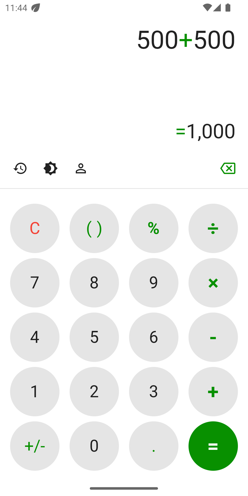   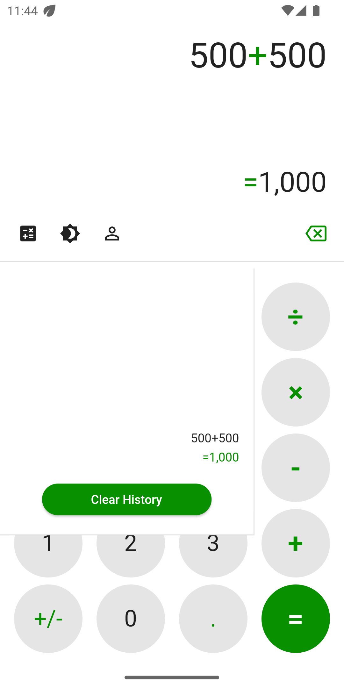   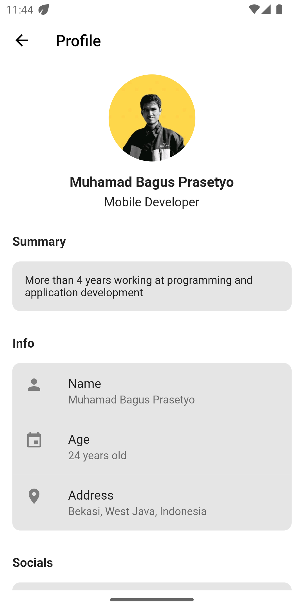   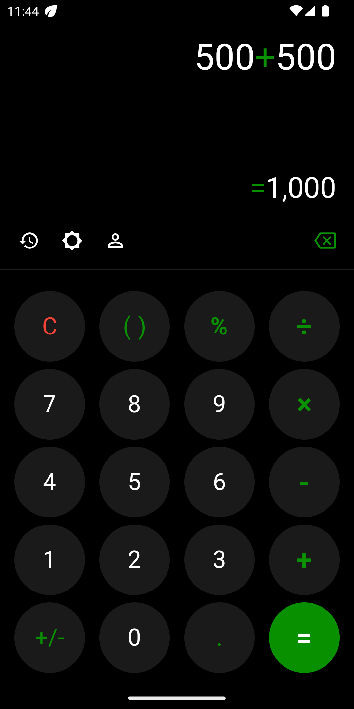   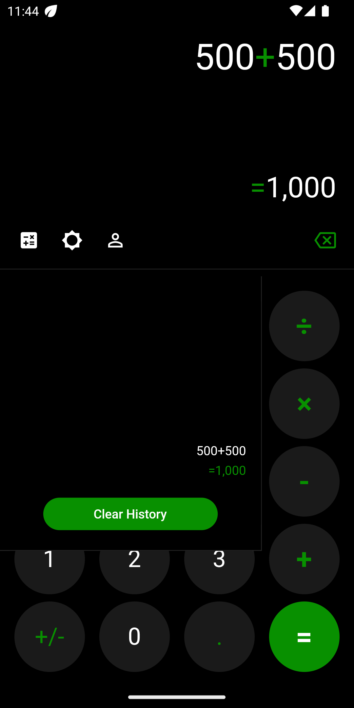   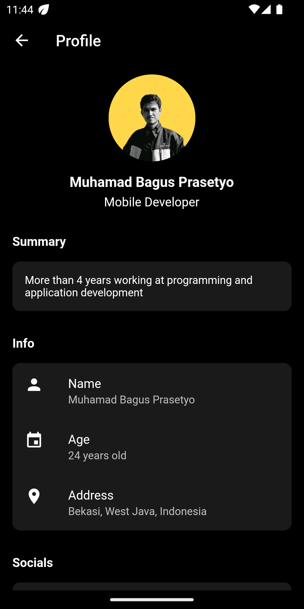
</pre>

## 📸 Example iOS
<pre>
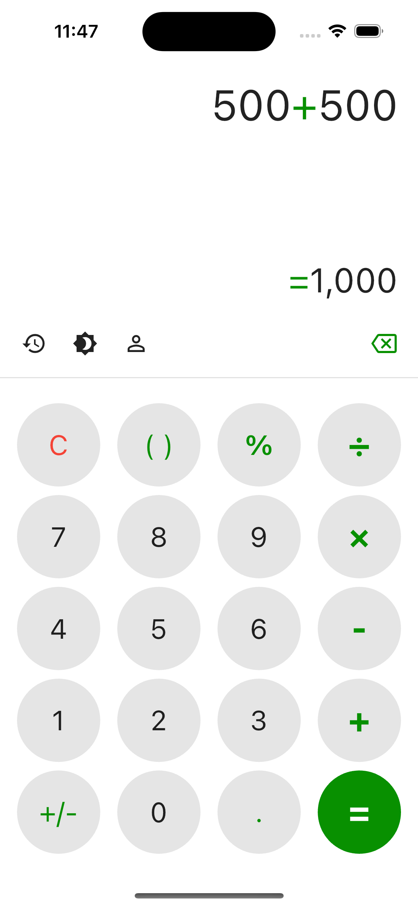   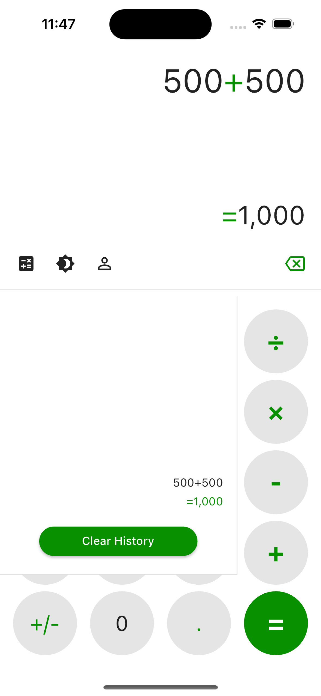   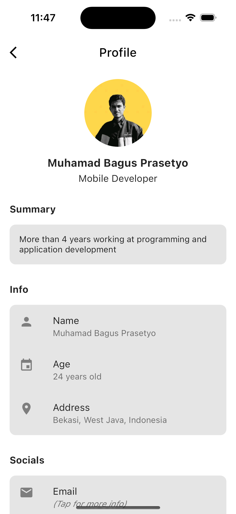   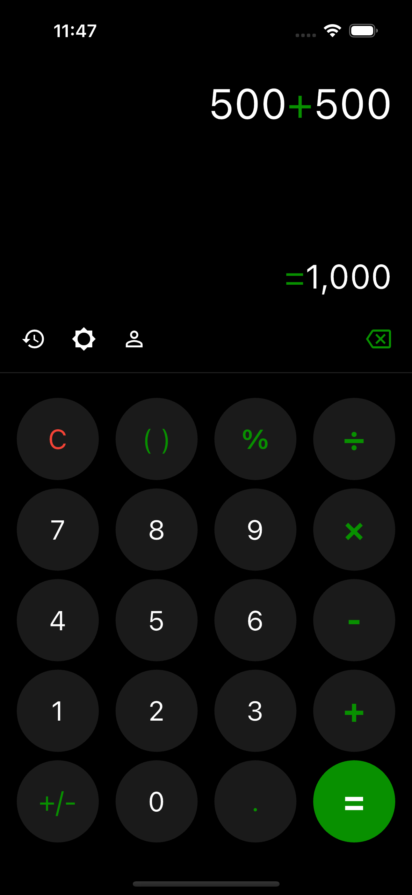   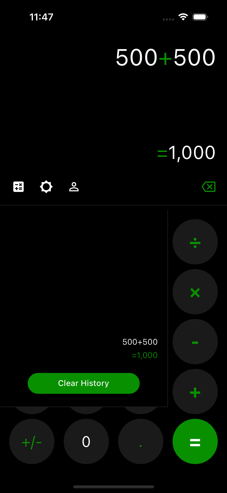   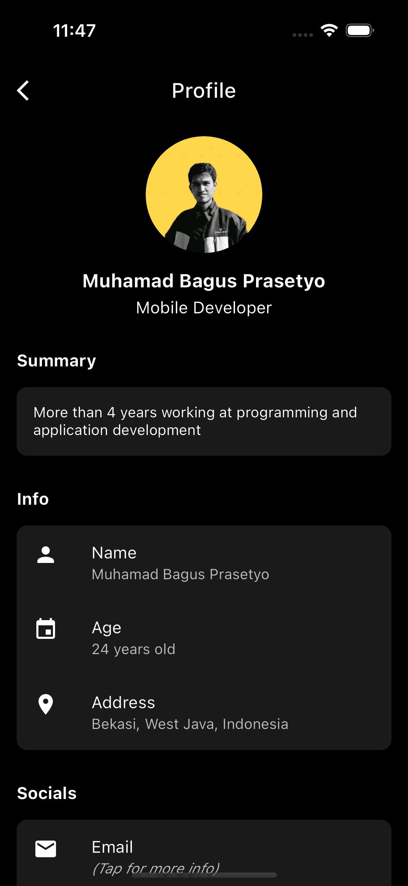
</pre>

## Quick start
This mobile app made with **Flutter v3.10.6**. You should follow the instructions in the [official documentation](https://flutter.io/docs/get-started/install).
This project uses **BLoC** (business logic component) to separate the business logic with UI itself.
It's recommended to do self-study about it before jumping into the project [here](https://bloclibrary.dev/).

## Built With 🛠
| Package                                                                                    | Pub                                                                                                                  |
| ------------------------------------------------------------------------------------------ | -------------------------------------------------------------------------------------------------------------------- |
| collection | [](https://pub.dev/packages/collection)
| equatable | [](https://pub.dev/packages/equatable)
| flutter_bloc | [](https://pub.dev/packages/flutter_bloc)
| hydrated_bloc | [](https://pub.dev/packages/hydrated_bloc)
| material_design_icons_flutter | [](https://pub.dev/packages/material_design_icons_flutter)
| math_expressions | [](https://pub.dev/packages/math_expressions)
| path_provider | [](https://pub.dev/packages/path_provider)
| url_launcher | [](https://pub.dev/packages/url_launcher)
| build_runner | [](https://pub.dev/packages/build_runner)
| flutter_gen_runner | [](https://pub.dev/packages/flutter_gen_runner)
| flutter_lints | [](https://pub.dev/packages/flutter_lints)

## How To Run:
1. Clone this project.
2. Open with your favorite tools editor.
3. Run `pub get` on root project to generated pubspec.lock file.
4. Run the App using [this](https://github.com/mbp27/movie#run-the-app-with-command). Enjoy!

## Run The App with Command
```console
flutter run --dart-define appName='Calculator' --target=lib/main.dart
```

## Example APK
Difficult to run this project? I have included `.apk` for those of you who want to try [here](https://github.com/mbp27/calculator2/releases). Check out the assets section and download the latest version. Enjoy!

## Flutter Gen:
Generate every time you add or remove assets

```console
flutter packages pub run build_runner build
```

## Author

* **Muhamad Bagus Prasetyo**

Don't forget to follow me, fork and give me a ⭐

## License

```
MIT License

Copyright (c) 2023 Muhamad Bagus Prasetyo

Permission is hereby granted, free of charge, to any person obtaining a copy
of this software and associated documentation files (the "Software"), to deal
in the Software without restriction, including without limitation the rights
to use, copy, modify, merge, publish, distribute, sublicense, and/or sell
copies of the Software, and to permit persons to whom the Software is
furnished to do so, subject to the following conditions:

The above copyright notice and this permission notice shall be included in all
copies or substantial portions of the Software.

THE SOFTWARE IS PROVIDED "AS IS", WITHOUT WARRANTY OF ANY KIND, EXPRESS OR
IMPLIED, INCLUDING BUT NOT LIMITED TO THE WARRANTIES OF MERCHANTABILITY,
FITNESS FOR A PARTICULAR PURPOSE AND NONINFRINGEMENT. IN NO EVENT SHALL THE
AUTHORS OR COPYRIGHT HOLDERS BE LIABLE FOR ANY CLAIM, DAMAGES OR OTHER
LIABILITY, WHETHER IN AN ACTION OF CONTRACT, TORT OR OTHERWISE, ARISING FROM,
OUT OF OR IN CONNECTION WITH THE SOFTWARE OR THE USE OR OTHER DEALINGS IN THE
SOFTWARE.
```
